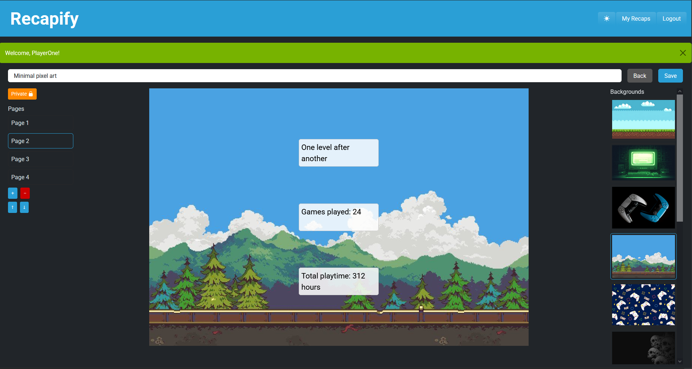
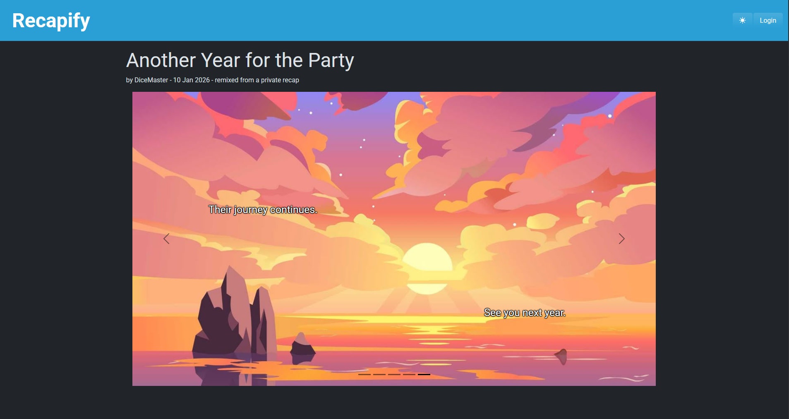

# Disclaimer

This project was developed as part of the Web Applications course at the Polytechnic University of Turin.

It is intended for academic and demonstrative purposes only and showcases a full-stack Single Page Application built with React (frontend) and Node.js/Express with SQLite (backend).

All images included in the application are publicly available resources used for educational purposes only. No copyright ownership is claimed. If any material infringes copyright, please contact me and it will be removed.

The code is provided as-is and is not intended for production environments.


# Exam #4: "Il mio anno in..."
## Student: REDACTED

## React Client Application Routes

- Route `/`: homepage
- Route `/recaps/:id`: visualize a single recap, defined by <id>
- Route `/login`: login
- Route `/myrecaps`: personal page of an authenticated user
- Route `/myrecaps/create`: first page of the editor, where you can choose between template or another recap and the theme
- Route `/myrecaps/create/editor`: editor of the chosen template or recap

## API Server
### "Viewer API"
- GET `/api/recaps`
- GET `/api/recaps?themeId=:themeId`
  - Get all public recaps (for homepage) or all public recaps by theme.
  - query parameters: themeId (optional)
  - response body content:
    ```json
    [{
      "id": 1,
      "title": "Il mio anno in videogiochi",
      "themeId": 1,
      "themeName": "videogiochi",
      "authorId": 1,
      "authorUsername": "PlayerOne",
      "createdAt": "2024-12-24",
      "previewImage": "vg_start_screen.jpg"
    },
    {...}]
    ```
- GET `/api/recaps/myrecaps`
  - Get all recaps for a single user (for personal area).
  - request parameters: session cookie (mandatory)
  - response body content:
    ```json
    [{
      "id": 1,
      "title": "My Year in Gaming",
      "themeId": 1,
      "themeName": "Videogames",
      "authorId": 1,
      "authorUsername": "PlayerOne",
      "createdAt": "2024-12-24",
      "previewImage": "vg_start_screen.jpg"
    },
    {...}]
    ```
- GET `/api/recaps/:id`
  - Get a single recap by id.
  - request parameters: id (mandatory), credentials (optional)
  - response body content:
    ```json
    {
      "id": 1,
      "title": "My Year in Gaming",
      "themeId": 1,
      "themeName": "Videogames",
      "authorId": 1,
      "authorUsername": "PlayerOne",
      "visibility": "public",
      "derivedFromRecapId": null,
      "createdAt": "2024-12-23T23:00:00.000Z",
      "isTemplate": false,
      "pages": [
        {
          "id": 1,
          "recapId": 1,
          "pageIndex": 0,
          "background": {
            "id": 1,
            "themeId": 1,
            "imagePath": "vg_start_screen.jpg",
            "slots": 2,
            "layout": {"slots": [{"x": 50,"y": 40}, {"x": 50,"y": 65}]}
          },
            "texts": [
              {"id": 1,"pageId": 1,"slotIndex": 0,"content": "Press START to begin"}
             ]
        },
        {...}
      ]
    }
    ```
- GET `/api/recaps/:id/derived-from`
  - Get information about the original recap from where the id-recap is from.
  - request parameters: id (mandatory), credentials (optional)
  - response body content:
    ```json
    {
      "exists": true,
      "accessible": true,
      "id": 1,
      "title": "My Year in Gaming",
      "authorUsername": "PlayerOne"
    }
    ```
    Note: if the original recap has become it returns:
    ```json
    {
      "exists": true,
      "accessible": false
    }
    ```
- PATCH `/api/recaps/:id/visibility`
  - Change the visibility of a recap (from public to private and vice versa)
  - request parameters: id (mandatory), session cookie (mandatory)
  - request body content:
    ```json
    {"visibility": "public"}
    ```
  - response body content:
    ```json
    {"success": true}
    ```
### "Editor API"
- POST `/api/recaps`
  - Post a new recap
  - request parameters: session cookie (mandatory)
  - request body content:
    ```json
    {
      "title": "My 2024 in Games",
      "theme_id": 2,
      "visibility": "public",
      "derived_from_recap_id": null,
      "pages": [
        {
          "page_index": 0,
          "background_id": 7,
          "texts": [
            { "slot_index": 0, "content": "It all started here" }
          ]
        },
        {
          "page_index": 1,
          "background_id": 8,
          "texts": [
            { "slot_index": 0, "content": "So many hours played" }
          ]
        },
        {
          "page_index": 2,
          "background_id": 9,
          "texts": [
            { "slot_index": 0, "content": "Game over" }
          ]
        }
      ]
    }    
    ```
  - response body content:
    ```json
    {"id": "9"}
    ```
- GET `/api/templates?themeId=:themeId`
  - Get all templates by themeId
  - request parameters: session cookie (mandatory)
  - query parameters: themeId (mandatory)
  - response body content:
    ```json
    {
      "id": 3,
      "title": "Every adventure starts somewhere",
      "theme_id": 2,
      "themeName": "Role-Playing games",
      "previewImage": "rpg_introduction.jpg"
     }
    ```
- GET `/api/backgrounds?themeId=:themeId`
  - Get all backgrounds by themeId
  - request parameters: session cookie (mandatory)
  - query parameters: themeId (mandatory)
  - response body content:
    ```json
    [
      {
        "id": 7,
        "image_path": "rpg_introduction.jpg",
        "layout": {
          "slots": [{"x": 50,"y": 35},{"x": 50,"y": 70}]
        }
      },
      {...}
    ]
    ```
- GET `/api/themes`
  - Get all themes
  - request parameters: session cookie (mandatory)
  - response body content:
    ```json
    [
      {
        "id": 1,
        "name": "Videogames",
        "description": "Stats and memories from your gaming year"
      },
      {...}
    ]
    ```
### "Authentication API"
- POST `/api/sessions`
  - Login of a user
  - request body content:
    ```json
    {
      "username": "playerone@gmail.com",
      "password": "password123"
    }
    ```
  - response body content:
    ```json
    {
      "id": 1,
      "email": "playerone@gmail.com",
      "username": "PlayerOne"
    }
    ```
- GET `/api/sessions/current`
  - Get information about the currently authenticated user
  - request parameters: session cookie (mandatory)
  - response body content:
    ```json
    {
      "id": 1,
      "email": "playerone@gmail.com",
      "username": "PlayerOne"
    }
    ```
- DELETE `/api/sessions/current`
  - Logout of the current user
  - request parameters: session cookie (mandatory)
  - response body content: `<empty body>`
### "Assets"
- Images are served from `/images/<filename>` via express.static


## Database Tables

- Table `users` - contains user information such as email, hashed password and salt.
- Table `recaps` - contains recap information such as title, visibility, creation date, references to theme and author, and whether it is a user recap or a template.
- Table `backgrounds` - contains background image information such as image path, reference to theme id, number of text slots and layout (stored as JSON).
- Table `recap_pages` - contains all pages of all recaps (each row corresponds to a page of a recap or a template). Each row includes a reference to its background, its recap and its index within the recap.
- Table `recap_texts` - contains all texts of all recaps (each row corresponds to a single text). Each row includes a reference to its page, the slot index and the content.
- Table `themes` - contains theme name and a brief description.

## Main React Components

- `NavHeader` (in `NavHeader.jsx`): global navigation bar. Here the user can switch between light and dark mode and perform login/logout actions. Furthermore, it integrates the _navigation guard_ provided by `UnsavedChangesContext`, which is used by `RecapEditor`.
- `RecapHomePage` (in `RecapHomePage.jsx`): home page of the application. Here the user can see all public recaps (via a `ListGroup` of `RecapPreviewItem`).
- `RecapViewer` (in `RecapViewer.jsx`): page used to visualize a single recap. It implements a `Carousel` to navigate through the recap pages and renders texts according to the selected background layout.
- `MyRecaps` (in `MyRecaps.jsx`): personal page of the authenticated user. Here the user can see all their recaps (via a `ListGroup` of `RecapPreviewItem`), change their visibility or create a new recap.
- `CreateRecap` (in `CreateRecap.jsx`): first phase of the recap creation process. Here the user selects the theme and chooses whether to start from a template or from an existing public recap; this information is then passed to `RecapEditor`.
- `RecapEditor` (in `RecapEditor.jsx`): second phase of the recap creation process and actual editor. It contains all the forms, buttons and sidebars needed to create the recap, as well as validation logic before submission.

## Screenshot






## Users Credentials

| username                   | password      | note                                                                                                   |
|----------------------------|---------------|--------------------------------------------------------------------------------------------------------|
| playerone@gmail.com        | password123   |                                                                                                        |
| dicemaster@rpgmail.com     | RollTheDice   | this user has a recap from a self-private template                                                     |
| questgiver@fantasyworld.it | M41nQu3st     | this user has a recap derived from a public recap and a recap derived from a recap switched to private |
| superwario@bros.jp         | GoombaCupcake | this user doesn't have any recap                                                                       |
